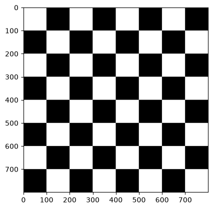
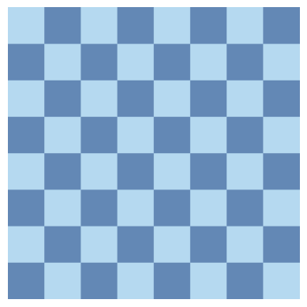
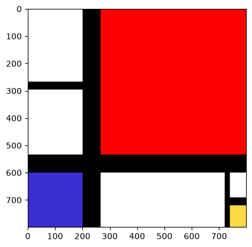
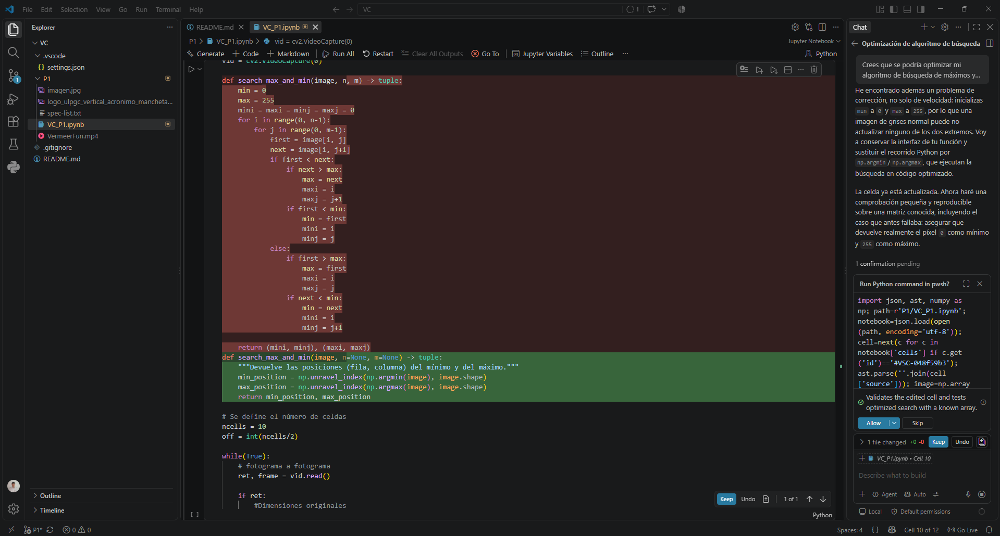
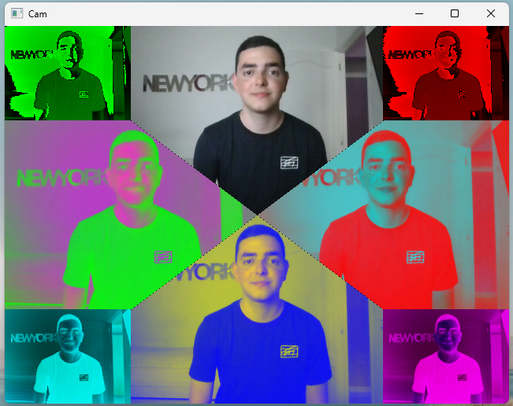

# Autores
Ubay Antonio Batista Santana  
Ángel Sergio Reyes Guedes

# Trabajo desempeñado
En esta sección incluiremos el desempeño individual de cada miembro del grupo en las tareas realizadas en esta práctica.

## Tarea 1
Para esta tarea, Ubay aportó el código generado manualmente y Sergio fue el encargado de solicitar a la Inteligencia Artificial el código para generar el tablero de ajedrez. Obteniendo los siguientes resultados:

<p align="center">


</p>


Como se puede observar, se obtuvieron resultados diferentes, tanto a nivel algorítmico como visual. La Inteligencia Artificial, en este caso, se excedió y añadió colores al tablero de ajedrez. No obstante, se puede ver cierto parecido en la comprobación del color que se hace tanto en el código manual como en el que genera la Inteligencia Artificial, ya que ambos comprueban si la suma de la fila y de la columna es par para decidir si pintar de claro u oscuro. Además, de que el código proporcionado por la Inteligencia Artificial elimina los números y los ejes que nos proporciona Matplotlib al crear un gráfico.

Conversación con la Inteligencia Artificial: https://claude.ai/share/1b370e5f-102c-4093-bbb3-1cbde082c3d1

## Tarea 2

El código que genera esta imagen, que sigue el estilo Mondrian, lo aportó Sergio, que optó por un conjunto de rectángulos sencillo que imita la obra original aportado en la práctica, pero con líneas menos simétricas y una paleta de colores más sencilla. Y Ubay corrigió los colores de los rectángulos pasando de RGB a BRG y su visualización en formato RGB. 

<p align="center">

</p>

## Tarea 3

Para el desarrollo de esta tarea, Sergio consultó con Inteligencia Artificial la forma más eficiente de encontrar los máximos y mínimos dentro de una matriz. Como resultado de esta conversación se optó por un algoritmo que recorriera los píxeles de la matriz comprobando el píxel actual con el de la misma columna, pero en la siguiente fila, para decidir cual era el mayor y menor de esta pareja y compararlos con los mínimos y máximos encontrados hasta el momento, reduciendo las comparaciones de 2N, siendo N el número de elementos de la matriz, a 1.5N. No obstante, tras finalizar el desarrollo del algoritmo de búsqueda, el agente de Copilot nos sugirió sustituirlo por las funciones optimizadas de numpy. Resultando en una experiencia fluida y sin saltos. Y Ubay arregló un problema con la resolución y color de la imagen tras el redimensionado que se usó para simplificar la imagen y reducir los datos a procesar.

Sugerencia de cambio del algoritmo:

<p align="center">

</p>

Vídeo demostrativo:

<p align="center">
<video src="videos/min_max_en_fotograma_demo.mp4" width="300" controls>
</p>

Conversación con la Inteligencia Artificial: https://share.gemini.google/TMVdLhjfAJ9t

## Tarea 4

Durante la implementación de este apartado, Sergio aportó el código que dividía la pantalla en distintos frames para el diseño del Pop Art, para lo que se utilizó la conversación que se incluye más abajo. Ubay solucionó un error con el escalado de las imágenes y aplicó las transformaciones de los colores.

Imagen demostrativa:

<p align="center">

</p>

Conversación con la Inteligencia Artificil: https://share.gemini.google/8Nasadt5PnZ2

## Tarea Adicional

Esta tarea se trata de un añadido a la práctica original que tuvimos la idea de implementar. Se trata de un modulador de los canales de colores mediante el ratón, pudiendo crear tu propio filtro de color. El funcionamiento del mismo es el siguiente: se usan los botones del ratón para cambiar entre los canales de la imagen, y con la rueda se puede modificar el valor de dicho canal. Para ello, Sergio estableció la base del funcionamiento, creando la función que permitía capturar el movimiento del ratón, para lo que usó la conversación que se incluye a continuación, y la comunicación de la lectura de imagen y el ratón en tiempo real, y Ubay desarrolló la transición de canales mediante los botones del ratón adaptando la solución inicialmente aportada, ya que no contemplaba cambiar el canal dinámicamente, y añadió una función para centrar el texto que indica el canal que se está utilizando.

Explicación de los controles:

Para el manejo de la demo que se muestra en esta tarea, se pueden usar los botones que proporciona el ratón: los botones izquierdo y derecho permiten cambiar entre canales rgb, en el sentido correspondiente, y la rueda del ratón, que actúa como un potenciómetro, permitiendo  movernos por el canal seleccionado.

Vídeo demostrativo:

<p align="center">
<video src="videos/inversion_color_demo.mp4" width="300" controls>
</p>

Conversación con la Inteligencia Artificial: https://share.gemini.google/odFoPvnl4YnD

Conversación con la Inteligencia Artificial sobre la función de centrado: https://share.gemini.google/QjTpegUA7Dza

## Inconvenientes

Durante el desarrollo de esta práctica, se tuvo que añadir la siguiente opción para encender la cámara de manera correcta en las celdas del cuaderno "Jupyter Notebook" que la requerian en esta línea:
```
cv2.CAP_DSHOW
```
Y en la siguiente línea, se muestra el resultado tras añadir la opción:

```
vid = cv2.VideoCapture(0, cv2.CAP_DSHOW)
```

# Fuentes
Códigos RGB: https://htmlcolorcodes.com/es/