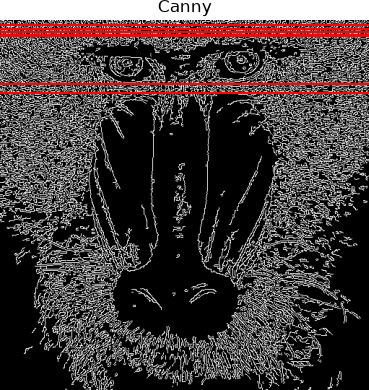
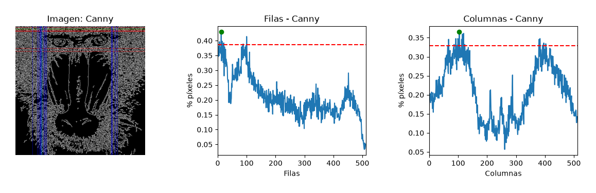
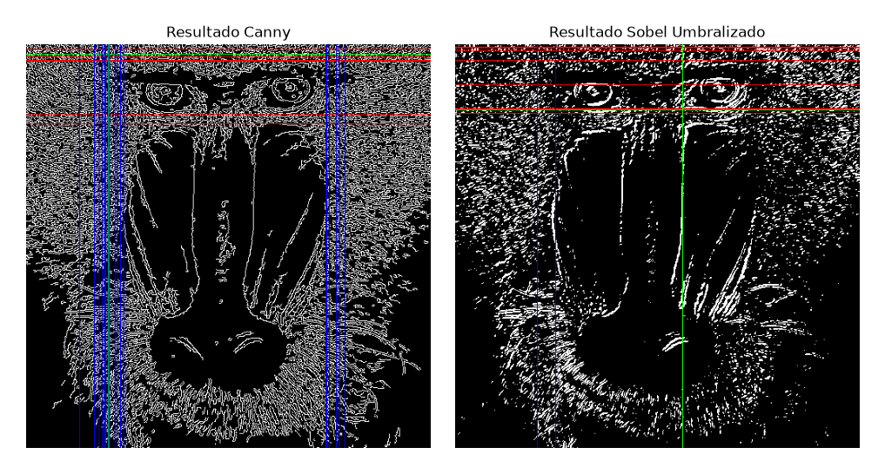

# Autores
[Ubay Antonio Batista Santana](https://github.com/UbayBatista) 
[Ángel Sergio Reyes Guedes](https://github.com/asergiorg)

# Trabajo desempeñado
## Tarea 1

Para la realización de esta tarea, se ha optado por un código sencillo, que parte del aportado como ejemplo para el conteo de las columnas. Para adaptar dicho código, se ha convertido el array resultante tras la suma en un vector de una sola dimensión, ya que al sumar por filas, el resultado es algo similar a lo siguiente: [[256],[243],...,[123]]. Para ello, se ha añadido la siguiente línea de código:

~~~python
row_counts = row_counts.flatten()
~~~

Tras esto, se normaliza el array según el número de columnas para obtener el número de píxeles blancos por fila:

~~~python
rows = row_counts / (255 * canny.shape[1])
~~~

Sobre este nuevo array, se busca la fila que contiene la mayor cantidad de píxeles blancos. Para encontrar este máximo, se utiliza la función `max` que ofrecen los propios arrays, ya que `rows` tiene dimensión 1:

~~~python
maxfil = rows.max()
~~~

Por último, lo que resta es graficar el resultado con las filas que contienen una cantidad mayor o igual al 90% del máximo.

~~~python
plt.figure(figsize=(12, 6))
    plt.subplot(1, 2, 1)
    plt.axis("off")
    plt.title("Canny")
    for i in range(len(rows)):
        if rows[i] >= maxfil*0.9:
            idx_rows_threshold.append(i)                                 # Añadimos el índice de la fila que cumple el umbral a la lista

            if i == idx_maxfil: 
                plt.axhline(y=i, color='g', linestyle='-', linewidth=1)  # Mostramos la fila con el máximo número de píxeles blancos
            else:
                plt.axhline(y=i, color='r', linestyle='-', linewidth=1)  # Mostramos las filas que superan el 90% del valor máximo
    plt.imshow(canny, cmap='gray')
~~~

Adicionalmente, se decidió mostrar una gráfica que enfrenta el porcentaje de píxeles con las filas, mostrando la fila con el máximo y el umbral que superan las filas con el 90% de los píxeles del máximo o superior:

~~~python
umbral = maxfil * 0.9  

plt.subplot(1, 2, 2)
plt.title("Respuesta de Canny")
plt.xlabel("Filas")
plt.ylabel("% píxeles")
plt.plot(rows, label='Porcentaje de píxeles blancos por fila')
plt.scatter(idx_maxfil, maxfil, color='g', zorder=5, label=f'maxfil = {maxfil:.2f}')  # Marcamos el máximo con un punto verde
plt.axhline(y=umbral, color='r', linestyle='--', label=f'0.90*maxfil = {umbral:.2f}')  # Línea horizontal para el umbral
# Rango en x definido por las filas
plt.xlim([0, canny.shape[0]])
plt.legend()
plt.tight_layout(pad=2.0, w_pad=3.0) # Ajustamos el espaciado entre subplots
~~~

Con esto, obtenemos el siguiente resultado:

## Tarea 2

Con el fin de evitar código duplicado, se decidió crear funciones auxiliares para obtener las filas y columnas de cada imagen, para resaltarlas en la imagen y para mostrar los resultados. La función para obtener las filas y columnas es la más sencilla, ya que realiza el conteo y devuelve las filas y columnas tras aplicar la normalización:

~~~python
def get_rows_columns(image):
    # Contamos el número de píxeles blancos (255) por fila
    # Sumamos los valores de los pixeles por fila
    row_counts = cv2.reduce(image, 1, cv2.REDUCE_SUM, dtype=cv2.CV_32SC1)

    # Contamos el número de píxeles blancos (255) por columna
    # Sumamos los valores de los pixeles por columna
    col_counts = cv2.reduce(image, 0, cv2.REDUCE_SUM, dtype=cv2.CV_32SC1)

    # Normalizamos en base al número de columnas, segundo valor devuelto por shape, y al valor máximo del píxel (255)
    # El resultado será el número de píxeles blancos por fila
    rows = row_counts[:, 0] / (255 * image.shape[1])

    # Normalizamos en base al número de filas, primer valor devuelto por shape, y al valor máximo del píxel (255)
    # El resultado será el número de píxeles blancos por columna
    cols = col_counts[0, :] / (255 * image.shape[0])

    return rows, cols
~~~

La función con la que se resaltan las filas y columnas que superan el umbral del 90% convierte la imagen que recibe como parámetro a BGR, calcula el máximo para las filas y para las columnas, y sus respectivos índices, y dibuja sobre la imagen líneas sobre las filas y columnas que superan la condición del umbral, retornando finalmente la imagen y la posición de las filas y columnas que superaban el umbral:

~~~python
def highlight_rows_columns(image, rows, cols, row_color=(0, 0, 255), col_color=(255, 0, 0), max_color=(0, 255, 0)):
    # Convertimos la imagen a BGR para poder dibujar en color
    image_bgr = cv2.cvtColor(image, cv2.COLOR_GRAY2BGR)

    # Obtenemos el valor máximo de píxeles blancos para filas y columnas
    maxfil = np.max(rows)
    maxcol = np.max(cols)

    # Obtenemos el índice de la fila y columna con el valor máximo de píxeles blancos
    idx_maxfil = np.argmax(rows)
    idx_maxcol = np.argmax(cols)

    # Buscamos y resaltamos las filas con un número de píxeles blancos mayor o igual que 0.90*maxfil
    idx_rows = []
    for i in range(0, len(rows)):
        if rows[i] >= (0.90 * maxfil):
            idx_rows.append(i)

            # Si la fila es la que tiene el máximo número de píxeles blancos, la resaltamos en verde, si no, en rojo
            if i == idx_maxfil:
                cv2.line(image_bgr, (0, i), (image_bgr.shape[1], i), max_color, 1)
            else:
                cv2.line(image_bgr, (0, i), (image_bgr.shape[1], i), row_color, 1)

    # Buscamos y resaltamos las columnas con un número de píxeles blancos mayor o igual que 0.90*maxcol
    idx_cols = []
    for i in range(0, len(cols)):
        if cols[i] >= (0.90 * maxcol):
            idx_cols.append(i)

            # Si la columna es la que tiene el máximo número de píxeles blancos, la resaltamos en verde, si no, en azul
            if i == idx_maxcol:
                cv2.line(image_bgr, (i, 0), (i, image_bgr.shape[0]), max_color, 1)
            else:
                cv2.line(image_bgr, (i, 0), (i, image_bgr.shape[0]), col_color, 1)

    return image_bgr, idx_rows, idx_cols
~~~

Por último, contamos con la función que grafica los resultados, en la que se muestran la imagen con las primitivas gráficas que indican las filas y columnas con un número de píxeles blancos mayor o igual al 90% del valor de la fila y columna con la mayor cantidad de píxeles blancos, y dos gráficas, que enfrentan al porcentaje de píxeles con filas y columnas:

~~~python
def plot_results(image_bgr, rows, cols, title):
    # Calculamos los valores máximos, sus índices y los umbrales de filas y columnas para construir las gráficas
    maxfil = np.max(rows)
    idx_maxfil = np.argmax(rows)
    umbral_fil = 0.90 * maxfil

    maxcol = np.max(cols)
    idx_maxcol = np.argmax(cols)
    umbral_col = 0.90 * maxcol
    
    # Mostramos el resultado y las cuentas gráficamente
    plt.figure(figsize=(12, 4))

    plt.subplot(1, 3, 1)
    plt.axis("off")
    plt.title(f"Imagen: {title}")
    plt.imshow(cv2.cvtColor(image_bgr, cv2.COLOR_BGR2RGB), cmap='gray') 

    plt.subplot(1, 3, 2)
    plt.title(f"Filas - {title}")
    plt.xlabel("Filas")
    plt.ylabel("% píxeles")
    plt.plot(rows)
    plt.scatter(idx_maxfil, maxfil, color='g', zorder=5)  # Marcamos el máximo con un punto verde
    plt.axhline(y=umbral_fil, color='r', linestyle='--')  # Línea horizontal para el umbral
    # Rango en x definido por el número de filas de la imagen
    plt.xlim([0, image_bgr.shape[0]])

    plt.subplot(1, 3, 3)
    plt.title(f"Columnas - {title}")
    plt.xlabel("Columnas")
    plt.ylabel("% píxeles")
    plt.plot(cols)
    plt.scatter(idx_maxcol, maxcol, color='g', zorder=5)  # Marcamos el máximo con un punto verde
    plt.axhline(y=umbral_col, color='r', linestyle='--')  # Línea horizontal para el umbral
    # Rango en x definido por el número de columnas de la imagen
    plt.xlim([0, image_bgr.shape[1]])

    plt.tight_layout(pad=3.0, w_pad=4.0) # Separación entre plots

    plt.savefig(f"./images/exercise2_{title}.png",
                    bbox_inches='tight',
                    pad_inches=0)
    
    plt.show()
~~~

Tras aplicar las funciones anteriores, obtenemos los siguientes resultados:

Como se puede observar en la siguiente imagen, existe una gran diferencia entre ambas técnicas de detección de bordes. La principal causa es que, aplicando Sobel sobre una imagen umbralizada se reduce la carga de saltos menos significativos y se enfoca en otros como el contorno de la cara, enfatizando en los grandes saltos y suavizando los de menor valor. Situación opuesta al resultado que ofrece Canny, ya que este aplica la misma importancia a todos los bordes que detecta, resultando en un detalle tan fino como los saltos en el pelo del animal.

## Tarea 3

Nuestra propuesta a partir de los vídeos visionados en clase consiste en un juego que aplica un principio sencillo: que no te atrape el cuadrado. El juego se inicia y escanea el fondo sin el jugador para aplicar únicamente bordes sobre el jugador. Para ello, se inicia primero el sustractor de fondo MOG2 sin sombras:

~~~python
background_subtractor = cv2.createBackgroundSubtractorMOG2(history=500, varThreshold=50, detectShadows=False)
~~~

Después, en el periodo de calibración dentro del bucle del juego:

~~~python
if time.time() - start_time < calibration_seconds:
    # Actualizamos el fondo de la escena sin la presencia del jugador
    foreground_mask = background_subtractor.apply(frame)
~~~
Tras la calibración, tiene lugar el proceso de detección de bordes aplicando Canny. Para ello, se paraliza el aprendizaje de fondo, evitando que memorice al jugador, y eliminamos el ruido del primer plano para facilitar la detección de bordes:

~~~python
# Congelamos el aprendizaje del fondo (learningRate=0) para que no memorice al jugador si se queda quieto
foreground_mask = background_subtractor.apply(frame, learningRate=0)

# Aplicamos umbralización para eliminar el ruido de la máscara de primer plano
_, foreground_mask = cv2.threshold(foreground_mask, 200, 255, cv2.THRESH_BINARY)

# Convertimos el fotograma a escala de grises para la detección de bordes
gray_frame = cv2.cvtColor(frame, cv2.COLOR_BGR2GRAY)

# Obtenemos los bordes del jugador usando el algoritmo de Canny
edges = cv2.Canny(gray_frame, 100, 200)

# Filtramos los bordes del jugador usando la máscara para quedarnos solo con la silueta del jugador
player_edges = cv2.bitwise_and(edges, edges, mask=foreground_mask)
~~~

Una vez ha finalizado este proceso, un cuadrado empieza a moverse en la pantalla. Tras un tiempo aleatorio, este cuadrado se detiene en una posición, considerando que el estado de juego actual es de "captura". 

~~~python
if game_state == "MOVING":
    # Movemos el cuadrado
    x += dx
    y += dy

    # Detectamos las colisiones con los bordes del fotograma y cambiamos la dirección si es necesario
    if x <= 0 or x + square_size >= width: dx = -dx
    if y <= 0 or y + square_size >= height: dy = -dy

    # Comprobamos si es hora de capturar
    if time.time() >= state_change_time:
        game_state = "CAPTURING"
        state_change_time = time.time() + 2  # Capturamos durante 2 segundos
~~~

Si las partes del jugador que han quedado dentro de este son superiores a un umbral, la partida finaliza:

~~~python
elif game_state == "CAPTURING":
    # Extraemos la región de interés (ROI) de los bordes del jugador
    square_roi = player_edges[y:y+square_size, x:x+square_size]

    # Contamos el número de píxeles blancos (bordes del jugador) en la ROI
    edge_count = cv2.countNonZero(square_roi)

    # Comprobamos si el jugador ha sido atrapado (más de 50 píxeles blancos denotan que el jugador está dentro del cuadro)
    if edge_count > 50:
        game_state = "CAUGHT"
        state_change_time = time.time() + 3  # Mostramos el mensaje de "CAUGHT" durante 3 segundos
    else:
        # Si se acaba el tiempo de captura y no se ha atrapado al jugador, se salva
        game_state = "SAFE"
        state_change_time = time.time() + 3  # Mostramos el mensaje de "SAFE" durante 3 segundos
~~~

Vídeo demo:

[▶️ Ver vídeo del funcionamiento](https://drive.google.com/file/d/1sWQoSc4HZoF75jCzQOqRraK5ZUSEFf7t/view?usp=sharing)

## Tarea Adicional

Tras ver los vídeos se nos ocurrió implementar un juego de memoria de secuencia; sin embargo, tras varias conversaciones con la Inteligencia Artificial comprendimos que la complejidad excedía el alcance estimado para este trabajo, por lo que decidimos utilizar las soluciones que nos habían aportado las inteligencias artificiales para hacer una comparativa. Para ello, hemos decidido comparar dos métodos de detección de posición: el primero es en base al color, con un detector de color por HSV; el segundo, detecta bordes y establece la posición más alta del jugador con la premisa de que esta debe corresponder a la mano que se alza.

Una vez establecida la premisa, explicamos en qué consiste el juego: se trata de un juego de memoria de secuencia con cuatro rectángulos, se genera un patrón aleatorio que se reproduce y el usuario tiene que memorizar para repetirlo, si acierta, el patrón crece, si se equivoca, vuelve al punto de partida.

Vídeo demostrativo por detección de color:

[▶️ Ver vídeo del funcionamiento](https://drive.google.com/file/d/1Gh_F75WlLwHuBRsfJHyQE7caxH4g1E6V/view?usp=sharing)

Vídeo demostrativo por detección de bordes:

[▶️ Ver vídeo del funcionamiento](https://drive.google.com/file/d/1-rjTrkX_t8R1Sw2c7Pdjp4prMePaA26y/view?usp=sharing)

Tras ver el resultado, podemos deducir que el código que mejores resultados ofrece para el objetivo del juego es el de detección de colores porque el detector de bordes aplica de mejor manera para imágenes estáticas. Sin embargo, al añadir movimiento pierde precisión y salta de una posición a otra, ofreciendo una peor experiencia que el detector de colores.

### Conversaciones con la Inteligencia Artificial
Para desarrollar la versión con detección de color mediante HSV:
- https://chatgpt.com/share/6ac74c28-fe6c-83eb-811a-bb11bca320b6
- https://chatgpt.com/share/6ac74c47-2350-83eb-9a62-4db67ec7473e

Para desarrollar la versión con detección de bordes:
- https://chatgpt.com/share/6ac74c73-0ffc-83ed-b1b5-744db7db517c

## Aportación de cada miembro del grupo en las tareas realizadas en esta práctica
- Tarea 1: Ubay y Sergio
- Tarea 2: Ubay
- Tarea 3: Ubay
- Tarea Adicional: Sergio
- README: Sergio

